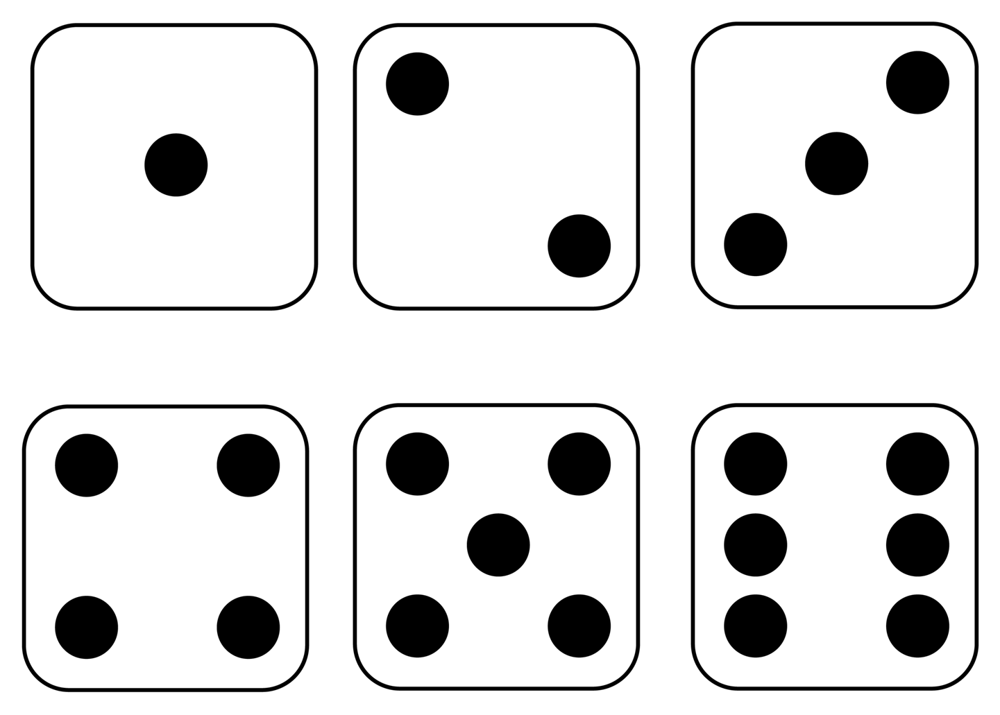

# Arduino Challenges

Here are some programming challenges you can take on as you continue to explore the Arduino!

## Beginner

### Button Light Toggle

Write a program to toggle the LED light on and off using a button press.

**Requirements:**

The light should begin in an off state. When the button is pressed, the light should turn on and stay on until the button is pressed a second time. The light should toggle on and off with each button press.

**Solution:** [Button/Light Toggle Program](/programs/Button_Sketch_2.ino)

### Print Your Name

Write a program that prints your first and last name on the OLED.

**Requirements:**

Print your name on two separate lines of the OLED.

> Hint: use the `oled.clearDisplay();` function to wipe old data from the screen.

**Solution:** [Name Example](programs/OLED_Name_Sketch.ino)

### Light Delay

Write a program that will blink the LED light at variable intervals based on rotary input.

**Requirements:**

Use the LED output to turn the light on and off on repeat, but instead of setting the delay to a fixed value (like `500`), use the rotary potentiometer to allow the user to adjust the delay between each light change. If the rotary is turned all the way down, the light should blink slowly. As the rotary is turned, the blinking should get faster, and when it is all the way up, the light should stay on.

**Solution:** [Rotary Light Program](programs/Rotary_Light_Sketch.ino)

## Intermediate

### Night Light

Create a night light that automatically turns on when the light level in the room falls below a certain threshold.

**Requirements:**

Write a program that uses the light detector to sense the light level in the room. When the light level falls below a certain threshold, turn on one of the LED output devices as a "night light."

> Tip: Use the Serial Plotter to compare various light levels to see when you should turn the night light on.

**Solution:** [Night Light Program](programs/Night_Light_Sketch.ino)

### Chiptunes

[Chiptunes](https://en.wikipedia.org/wiki/Chiptune), also known as 8-bit music or chip music, are the synthesized sounds made famous in arcades and other video games. Find a song you like and create a chiptune version using the Arduino.

**Requirements:**

Write a program that plays a chiptune song. The program should define the frequencies and durations of the notes in the song and then play them when a button is pressed.

**Solution:** [The Lost Forest](/programs/Buzzer_Sketch_2.ino)

### Temperature Display & Toggle

Write a program that will display the current temperature on the OLED in either Fahrenheit or Celsius.
Allow the user to toggle between F and C.

> You can learn about how to integrate with the Grove's Temperature sensor here: [Detecting Temperature and Humidity](https://wiki.seeedstudio.com/Grove-Beginner-Kit-For-Arduino/#lesson-8-detecting-surrounding-temperature-humidity).

**Requirements:**

Download and include the `DHT` library into your program, then use it to read the temperature using your board's Temperature and Humidity sensor.

By default, display the temperature in Celsius. When the user pushes the button, convert the temperature to Fahrenheit and display the temperature accordingly. The button should toggle back and forth between C and F.

**Solution:** [Temperature Toggle](programs/Temperature_Sketch.ino)

### Beep Beep Selector

Write a program that lets the user select how many times they would like to hear the program beep.

**Requirements:**

Use the rotary potentiometer to read input from the user. Convert the analog value to a number between `1` and `5` and display the number on the OLED screen. When the user presses a button, take the number that is currently displayed on the screen and beep the buzzer that many times.

> Hint: you can use the [map() function](https://www.arduino.cc/reference/en/language/functions/math/map/) to convert the rotary input to a value between `1` and `5`.

For example, when the rotary is turned all the way down, the screen will display `1`. As the user turns the rotary, the number will increase slowly from `1` to `5` (`5` being the max value). If the user presses the button when a `3` is on the screen, the buzzer will beep three times.

**Solution:** [Rotary Select Beep Program](/programs/Rotary_Select_Sketch.ino)

### LED Strip Dial

Use the rotary potentiometer as a dial that "turns up" the lights on the RGB LED strip.

**Requirements:**

Using the rotary potentiometer as an input device, display the input level on the RGB LED strip. When the dial is turned all the way "down," all of the LEDs should be off, and as the dial is turned "up," the LEDs should turn on one by one until all of them are lit up. Light up the LEDs with your favorite color!

> Hint: use the `map()` function to convert the rotary input into an LED output.

**Solution:** [LED Dial](/programs/LED_Dial_Sketch.ino)

## Advanced

### Color Selector

Create a program that allows users to select the RGB values for the RGB LED strip.

**Requirements:**

On the OLED, display the individual RGB values of the LED strip. When the user presses a button, they can edit the values one at a time. The user can use the rotary potentiometer to update each RGB value and see the results on the RGB LED. When they are done, the updated values are displayed on the OLED screen and the RGB LED strip.

Example:

1. RGB values are displayed on OLED and the corresponding color is shown on the LED strip.
2. User presses a button to enter into edit mode. They begin by editing the Red value.
3. As the user twists the rotary potentiometer, the Red value modulates between `0` and `255`.
4. When the user presses the button, the selected Red value is saved and they can then begin editing the Green value.
5. Repeat steps 3 and 4 for Green and Blue.
6. Once all three colors have been selected, the OLED will display all three selected RGB values and the RGB LED will show that color.

> Note: Since the button is hardwired to use pin `6`, you will need to plug your RGB LED strip into a different pin with your Grove connector.

**Solution:** [LED Color Select Program](/programs/Color_Select_Sketch.ino)

### Double Dice Roll

Create a program that allows players to roll two dice which display their numbers with pips (dots).

**Requirements:**

Expand the [OLED dice program](programs/OLED_Dice_Sketch.ino) to include the following enhancements:

- Display two dice instead of one
- Draw pips on each die face instead of printing numbers to represent values
  
- Create a sound effect that plays when the dice are rolled

**Solution:** [Advanced Dice Roll](/programs/OLED_Dice_Sketch_2.ino)

### Clapper Light

Write a program that turns on the LED when a user claps twice. Clap on! Clap off!

**Requirements:**

Using the sound sensor, detect when the noise level goes above a certain level, i.e., when you clap your hands (the value for this sound level may change depending on your environment).

If a clap occurs twice within 2 seconds (2000 milliseconds), toggle the LED on and off.

> You can use the `millis()` to return a `long` value representing the current elapsed milliseconds to keep track of time.

**Solution:** [Clapper Program](/programs/Clapper_Sketch.ino)
