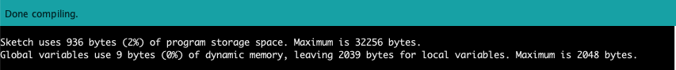

# Lesson 1: Turn on the Light

## Digital Output

The LED is a digital output, which means it operates on a digital signal. This will be a discrete value: 0 or 1. For our Arduino, this means `LOW(0V)` for 0, `HIGH(5V)` for 1.

For the Arduino to interact with the LED, we will need to do two things: register the LED as an output device, then send it a digital signal.

## Write the Program

We will register the LED as an output device in our `setup()` function. First, we’ll define a global variable for the LED pin.

```c
int LED_PIN = 4;

void setup() {
    pinMode(LED_PIN, OUTPUT);
}
```

Next, in the `loop()` function, we will send a digital signal to the light to turn it on and off.

```c
void loop() {
    digitalWrite(LED_PIN, HIGH);
    delay(1000);
    digitalWrite(LED_PIN, LOW);
    delay(1000);
}
```

The `digitalWrite()` method takes two parameters: the location where we want to send the signal, and the signal we want to send. Here, we’re sending `HIGH` (5V) and `LOW` (0V) signals to our `LED_PIN` with a 1000 millisecond delay in between each signal.

## Compile the Program

Once our program is written, we need to verify the code and send it to our Arduino. Click the Verify checkmark button to check (compile) the code.


Once the code is verified, you will see the output of the check at the bottom of the screen. Any errors in your program will appear here. If everything is good, it will say "Done Compiling."



## Upload the Program

Now, we need to connect our Arduino to the computer so that we can upload the code from our laptop to the micro-controller on our Arduino device. Click the Upload arrow.


Once the program is uploaded, you should see your Arduino turn on, and the light should start blinking! You have now written your first Arduino program.

Previous: [Hardware 101](/README.md)
Next: [Lesson 2: Pressing the Button](/Lesson02_Button.md)
