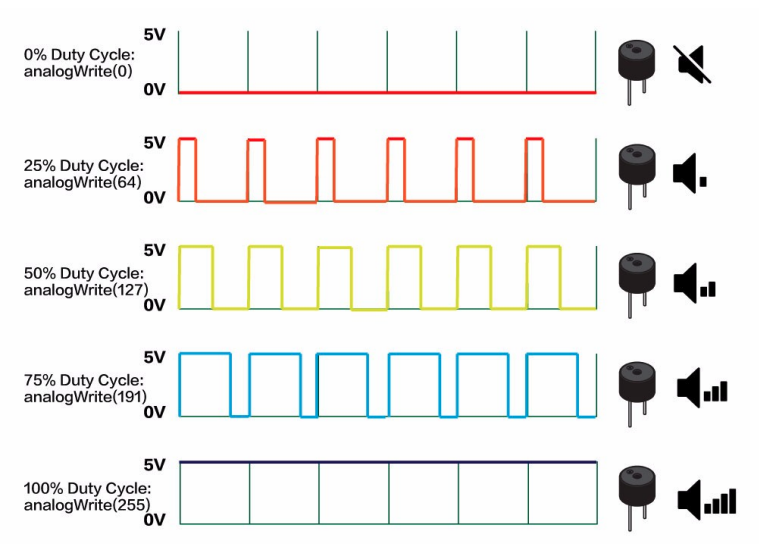

# Lesson 3: Doorbell Buzzer

## Buzzer

The buzzer is a digital output device that can be used to make beeping sounds. Although it is a digital component, you we can send various tones to the device using pulse width modulation.

### Pulse Width Modulation

Using the `analogWrite()` method, we can control the buzzer's tone using pulse width modulation (PWM). PWM is a method of simulating an analog signal with a digital input.

If you are familiar with morse code, you know that digital signals are used to create short and long pulses that represent letters and numbers. In a similar way, our program can send short and long pulses to a digital output device to communicate a variable output. This is the basis of PWM.



We will register the buzzer as an `OUTPUT` pin. Then, we'll send a PWM signal to the buzzer using the `analogWrite()` function. Although the buzzer is a digital output device, since we are sending an 8-bit value (a number between `0` and `255`) to the buzzer, we will use the `analogWrite()` method.

## Button Buzzer Program

We will start by simply using the button to plan a buzzer sound. This program will be almost identical to our LED/button example. We'll register both the button and buzzer pins as input/output devices, then read the button's value to trigger the buzzer's beep.

```c
int BUZZ_PIN = 5;
int BUTTON_PIN = 6;

void setup() {
    pinMode(BUZZ_PIN, OUTPUT);
    pinMode(BUTTON_PIN, INPUT);
}

void loop() {
  int buttonState = digitalRead(BUTTON_PIN);

  if (buttonState == HIGH) {
    analogWrite(BUZZ_PIN, 128);
  }
  else {
    analogWrite(BUZZ_PIN, 0);
  }
}
```

When you upload and run the program, you should be able to trigger the buzzer sound using a button press.

> You can play with various values for `analogWrite()`, using numbers between `0-255` to hear the various tones, but they will mostly sound the same.

## Playing Different Notes

Although we can modulate the pulse of our signal with `analogWrite()`, this method does not affect the frequency (or note) of the signal. Arduino allows us to play specific frequencies using the `tone()` method.

The `tone()` function accepts three parameters: the pin, the note value, and the duration (in ms). For example, this would play a `C` note for one second:

```c
tone(BUZZ_PIN, 65, 1000);
```

Here are some common notes you can use with `tone()`:

| Note | Value |
| --- | --- |
| C | 65 |
| D | 73 |
| E | 82 |
| F | 87 |
| G | 98 |
| A | 110 |
| B | 123 |
| C | 131 |

> You can find additional notes here: [musical notes](https://github.com/bhagman/Tone#musical-notes).

Let's write a function that will play a tune using some of these tones. First, we'll define some constants for the notes we will need at the top of our file:

```c++
#define NOTE_F 87
#define NOTE_A 110
#define NOTE_B 123
#define NOTE_D 147
#define NOTE_E 165
```

We'll also define some arrays to program the melody and duration of each note in our tune (add this after our pin variables):

```c++
int melody[] = {
  NOTE_F, NOTE_A, NOTE_B,
  NOTE_F, NOTE_A, NOTE_B,
  NOTE_F, NOTE_A, NOTE_B, NOTE_E2, NOTE_D,
  NOTE_B, NOTE_C, NOTE_B, NOTE_G, NOTE_E
};

int durations[] = {
  1, 1, 2,
  1, 1, 2,
  1, 1, 1, 1, 2,
  1, 1, 1, 1, 4
};

int numNotes = 16;
```

Now we can define a function at the end of the program to loop through our melody array and play each note:

```c
void playTune() {
  for (int noteIdx = 0; noteIdx < numNotes; noteIdx++) {
    // convert duration to milliseconds
    int noteDuration = durations[noteIdx] * 250;
    // play note
    tone(BUZZ_PIN, melody[noteIdx], noteDuration);
    delay(noteDuration);
  }
}
```

Finally, we'll update the `loop()` method to call the `playTune()` method if the button is pressed:

```c++
void loop() {
  int buttonState = digitalRead(BUTTON_PIN);

  if (buttonState == HIGH) {
    playTune();
  }
}
```

Great! Now, if you upload and run the program, you can hear our custom "doorbell" tune play when the button is pressed.

### Write your own

Play around with the program to write your own tune!

Previous: [Lesson 2: Pressing a Button](/Lesson02_Button.md)
