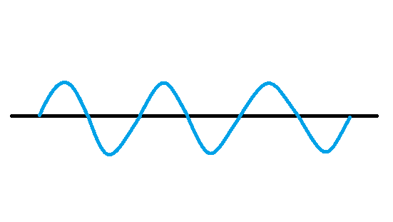
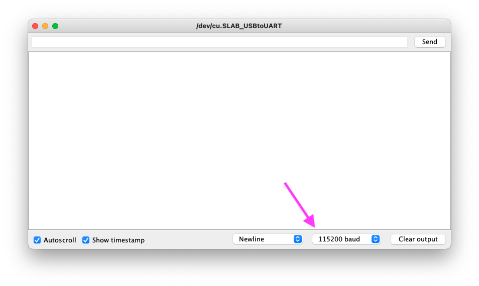
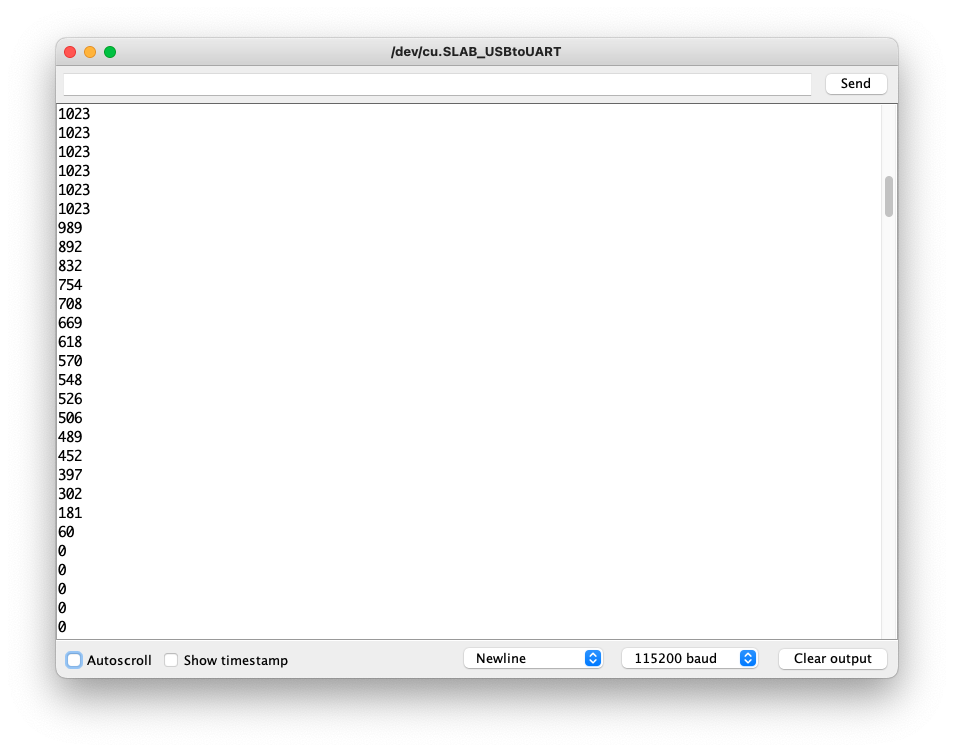
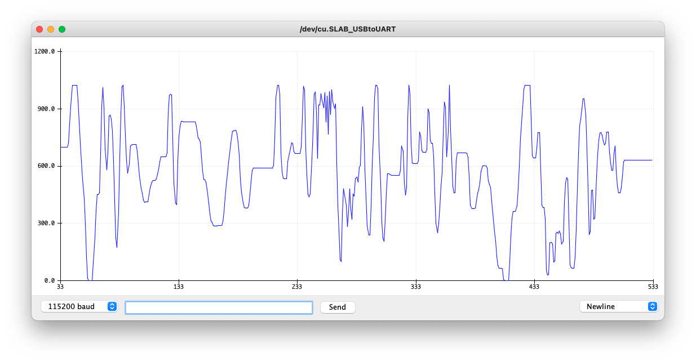

# Graph Data

In this lesson, we will learn how to write a program that uses an analog signal to read input from a rotary potentiometer. Then, we'll explore how to use the Serial Monitor and Serial Plotter to retrieve and display data from our program.

## Analog Signals

Barring the OLED, the input and output devices we have studied so far have been digital devices, which operate on an ON/OFF or LOW/HIGH voltage. Several Arduino sensors utilize an **analog** signal instead. Where a digital signal deals with two states, `0` and `1`, an analog signal represents a range of values.

[](https://wiki.seeedstudio.com/Grove-Beginner-Kit-For-Arduino/#lesson-3-controlling-the-frequency-of-the-blink)

Our Arduino's analog pins allow for a range of values between `0` and `1023`, where `0V` is mapped to `0`, `2.5V` is mapped to `512`, `5V` is mapped to `1023`, etc.

## Reading the Rotary Input

To read the analog value from our rotary potentiometer, we'll need to register the rotary as an input, then use the `analogRead` method to get the analog value.

Let's set up our initial program to read the analog value from our rotary:

```c++
int ROTARY_PIN = A0;

int rotaryValue = 0;

void setup() {
  pinMode(ROTARY_PIN, INPUT);
}

void loop() {
  rotaryValue = analogRead(ROTARY_PIN);
}
```

This is all of the code that we need to read the rotary value - but then what should we do with it? Let's take a moment to introduce the Serial Monitor.

### Serial Monitor

The Serial Monitor is a tool we can use to output data from our Arduino programs. You can think of this like your terminal or browser console. We can use the Serial Monitor to print results from our sensors or help us debug our programs.

You can open the Serial Monitor by clicking the magnifying glass icon in the upper right-hand corner of the screen, or by selecting `Tools` > `Serial Monitor` from your Arduino menu.

To use the Serial Monitor in our program, we first need to connect our device to the Serial Monitor in the `setup()` function using this method:

```c++
Serial.begin(115200);
```

The `115200` value is baud rate, which is the speed of our Serial communication. There are many options you can select, which can be found in this dropdown of your Serial Monitor.



It does not particularly matter which baud rate you select for this program, but you must make sure that the selected baud rate in your Serial Monitor matches the number you provide to the `begin()` method within your program.

Once you have added the `Serial.begin()` method to your `setup()` function, we can begin printing to the monitor. We will use the `Serial.println()` function to print values from our program to the screen.

Here is our updated program:

```c++
int ROTARY_PIN = A0;

int rotaryValue = 0;

void setup() {
  pinMode(ROTARY_PIN, INPUT);
  Serial.begin(115200);
}

void loop() {
  rotaryValue = analogRead(ROTARY_PIN);
  Serial.println(rotaryValue);
  delay(100);
}
```

When you upload and run this program on your Arduino, look at the output in the Serial Monitor. Now, twist the rotary potentiometer to see how the analog input changes within our program.



## Serial Plotter

Another useful tool that can be used to read sensor data is the Serial Plotter. The Serial Plotter is used to graph numerical data.

Open the Serial Plotter by selecting `Tools` > `Serial Plotter` and see how the rotary data is displayed on the screen!



## Other Analog Sensors

Our Grove kit includes two additional analog sensors alongside the rotary potentiometer: the light and sound detectors.

We can easily adjust our program to see how the Serial Monitor and Plotter displays data from these sensors. Let's try it out!

### Light Detector

To read input from the board's light detector, use the `A6` analog pin input. Make the appropriate changes within your program and test it out by opening the Serial Plotter. Use your hand to cover up the light detector on the board to see how the input is altered.

### Sound Detector

Similarly, we can use the `A2` pin to read input data from the sound detector. Update your program, then watch how your volume level impacts the data graphed on the Serial Plotter!

## Programming Challenges

Use analog input devices to controls how the Arduino outputs data to other sensors:

- [Variable Light Delay](Challenges.md#light-delay)
- [Beep Beep Selector](Challenges.md#beep-beep-selector)
- [Clapper Light](Challenges.md#clapper-light)

Previous Topic: [Lesson 5: Digital Dice](/Lesson04_OLED.md)

Next Topic: [Lesson 7: Sound Detector](/Lesson06_Rotary.md)
