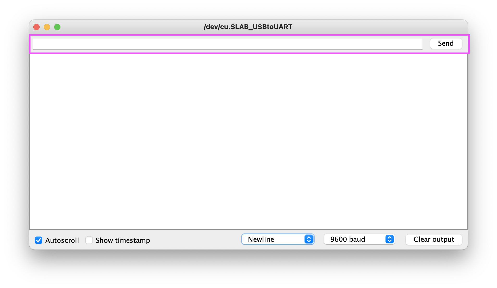

# Laptop Interaction

As you've seen in previous lessons, we can print data from our Arduino to our computer using the Serial Monitor or Plotter. In this lesson, we will take that further by learning how to send data to our Arduino from the computer and how to write a NodeJS program that interfaces with the Arduino.

## Serial Read

To print data to our Serial Monitor, we use the `Serial.print()` method. Similarly, we can send data from the Serial Monitor back to the Arduino using the text box and `Send` button in the Serial Monitor window.



Let's set up the program to connect to the Serial monitor, and to prepare the red LED light as an output.

```c++
#define LED_PIN 4

void setup() {
  pinMode(LED_PIN, OUTPUT);
  Serial.begin(9600);
}
```

Now, we're ready to read the Serial data. In the `loop()` function, we'll begin by checking if there is any data to read using the `Serial.available()` method:

```c++
void loop() {
  if (Serial.available()) {
    
  }
}
```

The `available()` method returns true if there is data to read, and false otherwise. If there is data, we can read it and store the data in a variable.

There are several methods we can use to read data. For example, `Serial.read()` will read the data one byte at a time. You can explore all of the methods available within the [Serial library](https://www.arduino.cc/reference/en/language/functions/communication/serial/), but for now we will focus on `Serial.parseInt()`. This method will read an integer value from the Serial.

Add this within your `if` statement:

```c++
  if (Serial.available()) {
    int input = Serial.parseInt();
    
  }
```

This will read an integer from the Serial and store it in the `input` variable. Next, we'll do some quick validation, then use the input to blink our LED the specified number of times. The completed `loop()` function will look like this:

```c++
void loop() {
  if (Serial.available()) {
    int input = Serial.parseInt();

    if (input > 0 && input <= 10) {
      for (int i = 0; i < input; i++) {
        digitalWrite(LED_PIN, HIGH);
        delay(200);
        digitalWrite(LED_PIN, LOW);
        delay(200);
      }
    }
  }
}
```

Test it out by running the program, entering a number between `1-10` in the Serial Monitor input, and clicking `Send`. You should see the LED blink that many times!

As you can see, just as we can print data from the Arduino to our computer, we can also read data from the computer and process it within our Arduino program.

## Interfacing with NodeJS

Although the Serial Monitor provides a primitive interface for our Arduino, what if we want to perform more complex logic and data processing on our computer? For example, what if we wanted to utilize the Arduino sensors as input into a NodeJS program? Or what if we needed to make an external API call within JavaScript and then process or display the result using and Arduino output device?

We can install and use the `serialport` npm package within our NodeJS programs to interact with Serial data from the Arduino board.

### Setting up Arduino

Before we dive into NodeJS, let's write a simple Arduino program that writes a message to Serial so we have something to listen for.

Create a new program in the Arduino IDE and add the following code:

```c++
void setup() {
  Serial.begin(9600);
}

void loop() {
  Serial.println("Hello from Arduino!");
  delay(1000);
}
```

> Note, the `println()` function will add a hidden `\n` character to the end of the message. This will be important when we go to read the message in NodeJS.

### Setting up Node

You can create a new NodeJS project by creating a new folder (e.g. named `node-arduino`) and adding a new file to it called `index.js`. Next, make it a Node project by running `npm init -y` within the directory.

Here is a list of terminal commands you can run to set this up:

```shell
mkdir node-arduino
cd node-arduino
touch index.js
npm init -y
```

Now, we can install the required packages for our program. We will use the `serialport` package to read data from Serial, and the `@serialport/parser-readline` package to help parse the bytes read from Serial into usable data. Run the following command to install theses packages into your project:

```shell
npm install serialport @serialport/parser-readline
```

> Note, if you are using the project built into this repository, you can run `npm install` in the `node` folder to install the dependencies.

## Reading from Serial in NodeJS

To read data from the Serial port in NodeJS, we'll need to take a few steps. First, we need to identify the path our Arduino is connected to from our computer. We'll use this to create a `SerialPort` connection. Then, we'll define a `parser` object that will be used to parse the bytes read from Arduino into usable data. Finally, we will set up event listener functions to respond to the Arduino.

### Defining the Port and Parser

We're ready now to start writing our program. Open the NodeJS project directory in VS Code and add this starter code to `index.js`:

```js
const { SerialPort } = require('serialport');
const { ReadlineParser } = require('@serialport/parser-readline');

const port = new SerialPort({
    path: '<Your-Path-String>',
    baudRate: 9600
});
const parser = port.pipe(new ReadlineParser("\n"));
```

This code creates references to the `SerialPort` and `ReadlineParser` libraries, then initializes objects that we can use to interact with the serial port data.

First, we define a `port` variable using the `path` name (which we'll find in a moment) and the `baudRate` defined in our Arduino program. Next, we create a `parser` object which will take all of the serial port's data and parse it into a string using a newline delimiter, `"\n"`.

Before we move on, let's identify the path to the Arduino and update the path string.

### Identifying the Arduino Path

We need to identify which path the Arduino is connected to from our computer. To start, use this command in your terminal to identify all of the ports open on your computer:

```shell
npx @serialport/list
```

> If this asks you if you want to install a package, you can press Enter.

This command should print out something similar to the following:

```shell
/dev/tty.BLTH
/dev/tty.Bluetooth-Incoming-Port
/dev/tty.SLAB_USBtoUART		Silicon Labs
```

We are looking for the USB port that our Arduino is connected to. This should be the same as the port you selected in the Arduino IDE's `Tools` > `Port` menu. In the example above, the Arduino's port is `/dev/tty.SLAB_USBtoUART`. Identify your computer's port name and copy it into your NodeJS code where it says `<Your-Path-String>`.

### Listen to Serial Port Events

Next, we'll define functions that will respond to events from the Serial port. The `SerialPort` library allows us to listen and respond to `open`, `close`, `data`, and `error` events, but we will just focus on `open` and `data` for now.

Add these two event listeners to the bottom of your your `index.js` program:

```js
// Confirm serial port is open
port.on('open', () => {
  console.log('Connected to Arduino');
});

// Read parsed serial data
parser.on('data', data => {
  console.log(data);
});
```

The first event listener is triggered when we successfully open a connection to the Arduino. When this occurs, we'll print a confirmation to the console.

The next event is set on the `parser` object and is triggered when data is read from Arduino. The `parser` will specifically look for chunks of data that end with the `"\n"` character, since we set that up as our delimiter. Every time the Arduino's `Serial` uses `println`, we will receive that message here and print it to the console.

Let's try it out!

Upload and start the Arduino program. Once it is running, start the NodeJS program by using the `node index.js` command in your terminal:

```shell
node index.js
```

If everything works as expected, you should see output similar to the following:

```shell
> node index.js
Connected to Arduino
Hello from Arduino!
Hello from Arduino!
Hello from Arduino!
Hello from Arduino!
...
```

You may notice that this program does not end - the connection to our Arduino will remain open until we terminate the program! You can stop the program by using the `ctrl + c` command on your keyboard.

We have successfully received data from the Arduino in our NodeJS program!

## Sending data from Node to Arduino

The final step for interacting between our Arduino and the computer is to write data back to the Arduino. We'll have to make updates to both programs (Arduino and NodeJS) to set this up.

### Sending data from Node

In the NodeJS program, let's add some code that will respond when data is received from the Arduino. Update the `data` event listener with the following:

```js
parser.on('data', data => {
  console.log(data);
  port.write('Hello from Node!');
});
```

The `port.write()` method will send data along the Serial port to the Arduino.

### Receiving data in Arduino

Similar to how we received data from the Serial Monitor, we'll need to set up our Arduino program to respond to data sent from NodeJS. We will use the OLED to display the data sent from Node, and instead of using a `delay()` to pause between sending messages, we'll use a timer so that we can still listen for responses between messages.

Update your Arduino program to include the following:

```c++
#include <U8g2lib.h>

U8X8_SSD1306_128X64_NONAME_HW_I2C oled(/* reset=*/ U8X8_PIN_NONE);

long current = 0;

void setup() {
  Serial.begin(9600);
  
  oled.begin();
  oled.setFlipMode(1); 
  oled.setFont(u8x8_font_7x14B_1x2_f);
}

void loop() {
  if (millis() - current > 2000) {
    Serial.println("Hello from Arduino!");
    current = millis();
    oled.clearDisplay();
  }

  if (Serial.available()) {
    oled.setCursor(0, 0);
    oled.print(Serial.readString());
  }
}
```

In this program, you can see that we are printing a message to the `Serial` every two seconds (and clearing the display). Then, when data is available to be read along the serial port, we read it and print it to the OLED.

Run the program to see our NodeJS and Arduino programs interacting with one another!

## Programming Challenges

Now that you are able to connect your Arduino to a NodeJS program, you can access Arduino sensor data in your backend APIs and connect to external APIs from your Arduino. The sky is the limit on what you can build!

Here is a project you can try out to practice integrating with an external API: [Weather Forecast](/Challenges.md#weather-forecast)

Previous Topic: [Lesson 6: Graphing Data](Lesson06_Analog.md)

Next Topic: [Lesson 8: Sound Detector](/Lesson08_RGB_LED.md)
