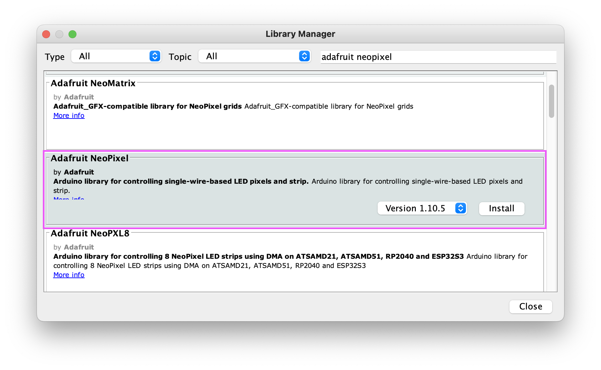

# Sound Meter

In this lesson, we'll learn how to use the RGB LED strip to display colored pixels. We'll then use our LED strip to create a sound meter that displays the noise level in the room.

## Connecting the RGB LED

As you may have noticed, your RGB LED strip does not come connected to our Grove Beginner Kit. This means we'll need to connect it manually with the provided Grove Connector.

Plug a Grove Connector into the RGB LED, then connect it to the `D6` pins on your Arduino. This will allow us to interact with the LED Strip via pin `6`, once we've installed the proper libraries.

### Installing the Library

Before we can communicate with the LED strip, we'll need to install the Adafruit NeoPixel library into our Arduino environment. With the Arduino IDE open, go to `Tools` > `Manage Libraries...` and search for the Adafruit NeoPixel library.



Select the latest version and click `Install`. After the installation, you can close the window.

We can test out our RGB LED strip by pulling up one of the Adafruit example programs. Go to `File` > `Examples` > `Adafruit NeoPixel`, then select the `RGBWStrandTest`. This will open up a sample program.

Before we upload and run the program, find the line within the code where the program defines the `LED_COUNT`. You can set this to `10`, or however many LED pixels are on your LED strip.

Next, locate the line where the constructor is called (`Adafruit_NeoPixel` - around line 20) and change the `NEO_GRBW` value to `NEO_GRB`). The full line should now read:

```c++
Adafruit_NeoPixel strip(LED_COUNT, LED_PIN, NEO_GRB + NEO_KHZ800);
```

Click `Upload` to see the RGB test in action!

We will walk through how to communicate with the RGB LED in the next program, but you can look through this code to begin familiarizing yourself with the Adafruit library.

## Programming our LED Strip

Now that we've confirmed our RGB LED strip is working, we can begin to write our own program for the strip. Create a new Arduino program called `RGB_LED_Sketch`.

The first thing we need to do in this program is include a reference to the `Adafruit_NeoPixel` library. This will give us access to the constructors and functions needed to communicate with the RGB LED strip.

Add this `#include` statement to the top of your file:

```c++
#include <Adafruit_NeoPixel.h>
```

Now, we can initialize our LED strip using the `Adafruit_NeoPixel` constructor. We'll first define few constant variables for our strip, then invoke the constructor:

```c++
#define LED_PIN   6
#define LED_COUNT  10
#define BRIGHTNESS 50 // (max = 255)

Adafruit_NeoPixel pixels(LED_COUNT, LED_PIN, NEO_GRB + NEO_KHZ800);
```

We're configuring our LED strip to be connected on pin `6`, and setting the number of LED pixels to `10`. We then create a new variable called `pixels`, which is an array that represents each of the lights our LED strip.

Now we're ready to initialize our LED strip. Add the following code to the `setup()` method to set up the `pixels`:

```c++
  pixels.begin();
  pixels.show();
  pixels.setBrightness(BRIGHTNESS);
```

The `begin()` method initializes the LED strip and is required. The `show()` and `setBrightness()` methods are optional, but they will turn off the LEDs and then set the brightness for the program.

With our `pixels` initialized, we're ready to light up the LED strip!

### Displaying Pixel Lights

Turning a light on for one of the pixels requires a few steps:

1. Define the color
2. Assign the color to the pixel(s)
3. Update the LED strip

To define a color, we will use the `pixels.Color()` method. This method accepts three RGB values, each ranging from `0` to `255`.

| Color | Method |
| --- | --- |
| Off (Black) | `pixels.Color(0,0,0)` |
| White | `pixels.Color(255, 255, 255)` |
| Red | `pixels.Color(255, 0, 0)` |
| Green | `pixels.Color(0, 255, 0)` |
| Blue | `pixels.Color(0, 0, 255)` |

> You can look up the RGB values for other common colors here: [RGB Color Chart](https://www.rapidtables.com/web/color/RGB_Color.html).

The `Color()` method defines a color value, which we then assign to an individual pixel (or to the entire strip). We can set an individual pixel using the `setPixelColor()` method, which accepts two parameters: the index of the pixel to update (indexed starting at `0`) and the color you want to assign.

This code, for example, would set the first pixel red:

```c++
pixels.setPixelColor(0, pixels.Color(255, 0, 0));
```

You can also assign the same color to the entire strip using this command:

```c++
pixels.fill(pixels.Color(0, 0, 255));
```

Once we have assigned colors to our pixels, we can use the `show()` to actually update the LED strip to display our color configurations.

### Color Cycle Example

Let's write a simple function that demonstrates these methods. We'll loop through the pixel strip to light up the LEDs one by one, then turn them off in reverse.

Add this function to the end of your program:

```c++
void cycleStrip(uint32_t color) {
  // turn the pixels on one by one
  for (int i = 0; i < pixels.numPixels(); i++) {
    pixels.setPixelColor(i, color);
    pixels.show();
    delay(100);
  }

  // turn the pixels off in reverse
  for (int i = pixels.numPixels() - 1; i >= 0; i--) {
    pixels.setPixelColor(i, 0);
    pixels.show();
    delay(100);
  }
}
```

This method accepts one `Color` parameter, then lights up the pixels in the `pixels` array one by one, with a slight delay in between each. The second loop starts at the end of the LED strip and loops through the `pixels` to turn each pixel off.

Let's test our new function. Add this code to the `loop()` function to try it out:

```c++
void loop() {
  // Cycle Red
  cycleStrip(pixels.Color(255, 0, 0));

  // Cycle Green
  cycleStrip(pixels.Color(0, 255, 0));

  // Cycle Blue
  cycleStrip(pixels.Color(0, 0, 255));
}
```

You should see the LED strip cycle through each pixel with our three colors!

## Exercise: Creating a Sound Meter

Let's look at a practical example of using our LED strip to display data from a sensor. We'll use input data read from our sound detector sensor to display the sound level on our RGB LED strip.

First, create a new program with this starter code to initialize our RGB LED strip and sound sensor:

```c++
#include <Adafruit_NeoPixel.h>

#define SOUND_PIN A2
#define LED_PIN   6
#define LED_COUNT  10
#define BRIGHTNESS 50 // (max = 255)

Adafruit_NeoPixel pixels(LED_COUNT, LED_PIN, NEO_GRB + NEO_KHZ800);

void setup() {
  pixels.begin();
  pixels.fill();
  pixels.show();
  pixels.setBrightness(BRIGHTNESS);

  pinMode(SOUND_PIN, INPUT);
}

void loop() {

}
```

Next, we'll write a function that can be used to light up a range of pixels. Add this to the bottom of your program:

```c++
void displayRange(int numPix, uint32_t color) {
  pixels.fill();  // clear pixels
  
  // fill range of pixels
  for (int i = 0; i < numPix; i++) {
    pixels.setPixelColor(i, color);
  }
  
  pixels.show();  // update LED strip
}
```

Finally, we'll add the logic to read data from the sound sensor and send an update to the LED strip. Add this to your `loop()` function:

```c++
void loop() {
  int soundValue = analogRead(SOUND_PIN);
  int pixelMap = map(soundValue, 0, 1023, 1, LED_COUNT);
  
  displayRange(pixelMap, pixels.Color(255, 0, 0));
}
```

We are using the built-in `map()` function here, which is used to convert a value (e.g. `soundValue`) from one range (`0-1023`) into another (`1-10`). This takes our sound meter input and converts it into a number that fits into our LED pixel count.

> Read more about the map function here: [map() Arduino Reference](https://www.arduino.cc/reference/en/language/functions/math/map/)

With that, let's run the program! Once you upload the program to your Arduino, you should see the sound level in your room displayed on the RGB LED strip. Clap, talk, and make some noise to test it out!

## Programming Challenges

Here are some challenges you can take on using the RGB LED strip:

- [LED Strip Dial](Challenges.md#led-strip-dial)
- [Color Selector](Challenges.md#color-selector)

Previous Topic: [Graphing Data](Lesson06_Analog.md)
Next Topic:
