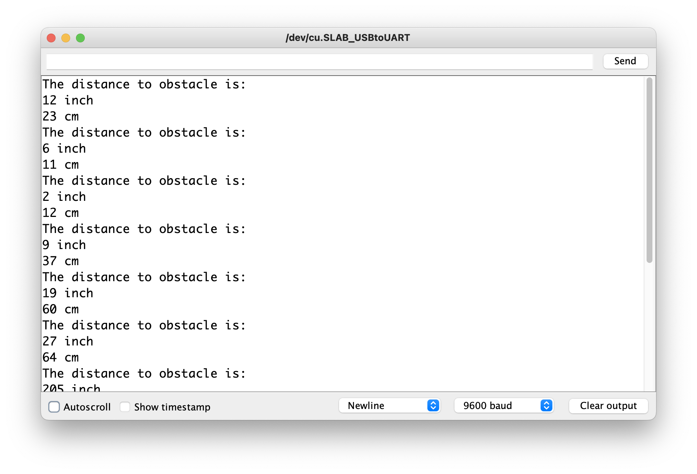

# Ultrasonic Distance Sensor

In this lesson, we'll learn how to use an Ultrasonic Distance Sensor (sometimes called an "Ultrasonic Ranger") to detect and measure distances between your Arduino device and other objects. Using the sensor, we will create a "walk-up doorbell" that plays a tone when someone approaches the device.

## Materials

You will need the [Grove Ultrasonic Distance Sensor](https://www.seeedstudio.com/Grove-Ultrasonic-Distance-Sensor.html) to complete this lesson, which does not come built into the Grove Beginner Kit.

Connect the distance sensor to the Arduino on port D2.

## Measuring Distance with the Ultrasonic Ranger

The Ultrasonic Ranger/Distance Sensor will measure the distance between the sensor and whatever object is in front of it. The sensor uses ultrasonic pulses to detect distances, similar to echolocation, and can measure distances in inches or centimeters.

The Arduino will communicate with the sensor via a digital port using Pulse Width Modulation (PWM). The Ranger can detect distances between 0-4 meters with an accuracy of ~1cm.

### External Library

To use methods from the Ultrasonic Distance Sensor, we will need to import the `Grove Ultrasonic Ranger` library, like so:

```c
#include "Ultrasonic.h"
```

## Reading Distance Measurements from Sensor

To begin, let's explore how the sensor reads in distances by creating a program that simply prints the output of the sensor to the Serial Monitor.

Create a new program and add this starter code. This will import the required library, define the input pin for our Ultrasonic Ranger, and then initialize an `Ultrasonic` object called `ultrasonic` using the specified pin.

```c++
#include "Ultrasonic.h"

#define RANGE_PIN 2

Ultrasonic ultrasonic(RANGE_PIN);
```

Next, we'll implement our `setup()` method to simply connect to the Serial Monitor:

```c++
void setup()
{
    Serial.begin(9600);
}
```

### Reading Distance from the Sensor

Reading distance measurements from the sensor is as simple as invoking the `MeasureInInches()` or `MeasureInCentimeters()` methods from the `ultrasonic` variable.

Before we write that code, let's define a global `DELAY` variable at the top of the file that we can use to space out our measurements:

```c++
int DELAY = 1000;
```

Now, we're ready to read the data from the sensor and print it out to the Serial Monitor in our `loop()`:

```c++
void loop()
{
    Serial.println("The distance to the obstacle is: ");
    long rangeInch = ultrasonic.MeasureInInches();
    Serial.print(rangeInch);
    Serial.println(" inch");
    delay(DELAY);
 
    long rangeCm = ultrasonic.MeasureInCentimeters();
    Serial.print(rangeCm);
    Serial.println(" cm");
    delay(DELAY);
}
```

You will need to adjust the sensor in such a way that you can move items farther from and closer to it. Run the program and open the Serial Monitor to see how far the nearest objects are from our Distance Sensor!



## Motion-Sensor Doorbell

Now that we know how to use the sensor, we're going to create a program that will perform logic based on the measured distance. Specifically, we will write a program that plays a doorbell tone when someone walks within a certain distance of the sensor.

To begin, we will need the same initial configurations as we used before: an import of the `Ultrasonic` library, a constant for our sensor pin, and an initialization of our `ultrasonic` sensor. However, we'll also need to configure our program to interface with the buzzer so that we can play notes (which we'll also define as constants). Here are all of the initializations our new program needs:

```c++
#include "Ultrasonic.h"

#define NOTE_C 523
#define NOTE_F 349

#define RANGE_PIN 2
#define BUZZ_PIN 5

int DELAY = 1000;
int rangeMin = 100;
int inRange = false;

Ultrasonic ultrasonic(RANGE_PIN);
```

Make note of the two additional variables, `rangeMin` and `inRange`. These two variables will be used to perform logic on the distance measured from the sensor. Right now, we're setting the program up to play a noise when someone comes within `100` centimeters of the sensor, but if you want to adjust to a different distance, you can do so here!

Next, we'll write our `setup()` method. This function will only need to configure our buzzer as an output device.

```c++
void setup()
{
  pinMode(BUZZ_PIN, OUTPUT);
}
```

Now, we're ready to start writing the logic for our program in the `loop()`. Our program will need to read the current distance from our Ultrasonic Ranger, then see if that distance is within our minimum distance for the alert. If a person has entered into range, we will play a sound. If not, we won't do anything.

```c++
void loop()
{
  long rangeCm = ultrasonic.MeasureInCentimeters();
  if (rangeCm < rangeMin) {
    if (!inRange) {
      ringDoorbell(); // only ring doorbell first time
    }
    inRange = true;
  } else {
    inRange = false;
  }
  delay(DELAY);
}
```

You can see that our program uses the `inRange` variable to conditionally play the sound. This makes sure we don't constantly ring the doorbell, and instead only do so when someone from out of range walks in range.

We're ready to try it out! Upload the program to your Arduino and see what happens when you move in and out of range of the sensor.

## Programming Challenge

What other ways could we integrate a distance sensor into IoT programs? You could create motion alarms, automated greetings, or even motion-activated lights.

Here is a programming challenges to integrate the Ultrasonic Distance Sensor to build a parking assistant:

- [Car Parking Helper](/Challenges.md#parking-helper)

Previous Topic: [Lesson 9: Speech Commands](/Lesson09_Speech.md)
