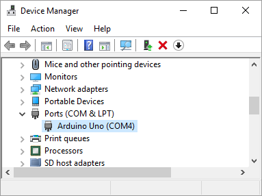
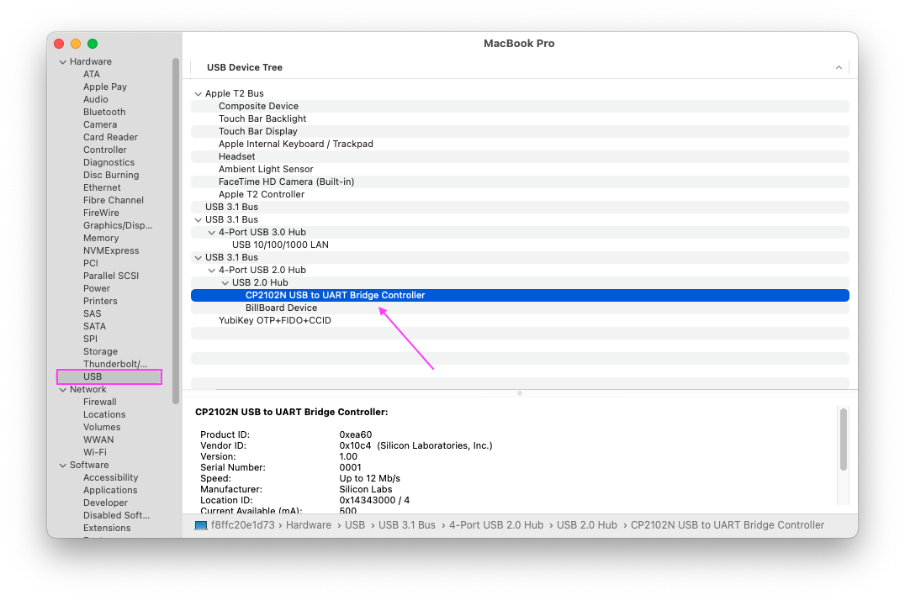

# Hardware 101

## Environment Requirements

To follow along with these resources, you will need the Grove Beginner Kit.

> Note: Several of the lessons use additional devices that are external to the Beginner Kit. Depending on which workshop you attend, you may not have every device mentioned within this repository.

To write programs for the Arduino and upload them to the device, you will need the [Arduino IDE](https://www.arduino.cc/en/software) software and the [USB Driver](https://www.silabs.com/developers/usb-to-uart-bridge-vcp-drivers) installed onto your computer. Further instructions for this setup are [below](#software-setup).

## Table of Contents

| Title | Components |
| --- | --- |
| [Lesson 1: Turn on the Light](/Lesson01_LED.md) | LED |
| [Lesson 2: Press a Button](/Lesson02_Button.md) | LED, Button |
| [Lesson 3: Doorbell Buzzer](/Lesson03_Buzzer.md) | Button, Buzzer |
| [Lesson 4: Display Text](/Lesson04_OLED.md) | OLED Display |
| [Lesson 5: Digital Dice](/Lesson05_OLED_Pt2.md) | OLED Display, Button |
| [Lesson 6: Graph Data](/Lesson06_Rotary.md) | Rotary Potentiometer, Serial Monitor, Serial Plotter |
| [Lesson 7: Laptop Interaction](/Lesson07_Node.md) | OLED, Serial |
| [Lesson 8: Sound Meter](/Lesson08_RGB_LED.md) | RGB LED Strip*, Sound Detector |
| [Lesson 9: Speech Commands](/Lesson09_Speech.md) | Speech Recognizer*, Buzzer |
| [Lesson 10: Measuring Distance](/Lesson10_Range.md) | Ultrasonic Distance Sensor*, Buzzer |
| [Programming Challenges](/Challenges.md) | All |

*Denoted devices are not included in the Grove Beginner Kit. Your workshop may or may not include these materials.

## Hardware Basics

Every computing device is made up of four basic components: input, output, storage, and a controller. An input device is how we send commands or data into the computer, an output device is how the computer communicates data back to the user, storage is used to store data and instructions, and the controller is where data is processed within the machine.

Some devices use what is called a **microcontroller**. A microcontroller is a chip that contains both a controller and storage, and is pre-programmed to do a designated task. If you consider a microwave, it has a simple microcontroller that is responsible for responding to button input, setting a timer, turning on the microwave, and then beeping and turning off the microwave when the timer runs out. All of these functions are programmed onto the microwave's microcontroller.

If you consider your laptop, the keyboard, mouse, and webcam are input devices, and the screen and any LEDs are output devices. Some components may act as both an input and output device; consider the touchscreen on a smartphone: this operates as both an input and output device for the computer.The RAM and hard drive on your computer make up the storage, and the CPU is the controller that processes commands. Your laptop is not a microcontroller in and of itself, but it does contain many microcontrollers that help perform individual tasks within it.

Today, we will be working with an Arduino. An Arduino is a single-board microcontroller that can be used to build small, digital computational devices.

The Arduino device included in your Beginner Kit is called a [Seeeduino Lotus](https://wiki.seeedstudio.com/Seeeduino_Lotus/), but we will refer to it as an Arduino throughout these lesson materials.

Your Arduino device is a motherboard that contains a microcontroller (MCU), several input and output ports, and pins. Peripheral devices and sensors (input and output devices) are connected to the Arduino using pins and wires. With traditional Arduino boards, you must connect each sensor and device to the Arduino by hand, using wires. However, your Grove beginner kit is essentially a giant motherboard that directly connects your sensors to the Arduino for us. Additional sensors can be connected to your device using wires, or by using the built-in Grove connectors.

See if you can locate these important parts of the Arduino computer:

- Analog Pins (A0-A5)
- Digital Pins (D0-D13)
- Power Pins
- IC2 Pins (SCL, SDA)
  - uses two lines to send and receive data (serial clock pin and serial data pin)
- UART port
  - Universal Asynchronous Receiver/Transmitter, a circuit used for serial communication between two devices
- ATmega328P-MU
  - Micro-controller chip
- IR Power chip
- USB port

### Sensors

Connected to our Arduino are multiple input and output sensors. Each sensor is pre-connected to a specific pin, which is labeled on the kit.

| Sensor | Pin Type | Pin # |
| --- | --- | --- |
| LED | Digital | 4 |
| Buzzer | Digital | 5 |
| OLED Display | I2C | I2C |
| Button | Digital | 6 |
| Rotary Potentiometer | Analog | A0 |
| Light Sensor | Analog | A6 |
| Sound Sensor | Analog | A2 |
| Temperature & Humidity Sensor | Digital | 3 |
| Air Pressure Sensor | I2C | I2C |
| Accelerometer | I2C | I2C |

You may have also received some additional, external sensors, which we can connect to the device manually:

- Mini PIR Sensor
- LED Strip
- Speech Recognizer

## Software Setup

We will use the Arduino IDE to write programs for our Arduino. This software will allow us to write code on our laptops, then send the program to the Arduino to run on the device.

Install the Arduino software for your OS here: <https://www.arduino.cc/en/software>

When prompted, you can click "Just Download".

You will also need to install a USB driver so that your computer recognizes the Arduino device when its plugged in. You can download the [CP2102 USB Driver](https://www.silabs.com/developers/usb-to-uart-bridge-vcp-drivers) here. Click "Downloads" when you get to the webpage and select the software for your operating system.

### Confirm Driver Installation

After the driver installation is complete, connect Arduino to the USB port of your computer with a USB cable.

You can confirm that the driver is installed if your computer is able to recognize the device.

**For Windows users:** You can see it in `My Computer` -> `Properties` -> `Hardware` -> `Device Management`. The device should appear as `COM`.

Take note of the `COM` number, you will need to reference it later.

**For Mac OS users:** You can navigate to `` on the top left corner, and choose `About this Mac` -> `System Report...` -> `USB`. A `CP2102 USB Driver` should appear.

If the driver is not installed or if the driver is installed incorrectly, it will appear as an "unknown device" in the device manager. At this point, the driver should be reinstalled.

### Setting up the Sketchbook

Arduino will save all of your programs in a **Sketchbook**. This is where your "sketches," or programs, are saved. This is also where Arduino will store external libraries that you install.

You are welcome to use Arduino's default location for your Sketchbook, but if you would like to access the libraries and programs already provided in this repository, you can update this location in the Arduino `Preferences`.

Open the Arduino IDE and select `Preferences` from the main menu. This will open a `Settings` panel with the `Sketchbook Location` at the top. If you select `Browse`, you can navigate to your `Hardware-101` git repository and select it as your new Sketchbook location.

Updating your Sketchbook location to this repository will give you access to the libraries needed in this course without having to download them. This will also allow you to open up the completed Lesson Examples and Challenge Solutions if you are interested in exploring and running them on your device

> To open programs in your Sketchbook, go to `File` > `Sketchbook` in Arduino and select the program you want to open.

## Connecting to the Arduino

When you open the Arduino IDE, you will see an empty Arduino program. Before we can start writing code, you'll need to confirm that your Arduino is connected and that the correct device is configured in your IDE.

- Go to `Tools` > `Board` in the menu and confirm that `Arduino Uno` is selected.
- Go to `Tools` > `Port` and select:
  - `COM_`, with the number you saw in the Device Manager (e.g. `COM11` or `COM3`). It should say `Arduino Uno` next to the correct option.
  - `/dev/cu.SLAB_USBtoUART` for Mac

With that, we're ready to write our first program in the Arduino IDE!

Next: [Lesson 1: Turn on the Light](/Lesson01_LED.md)
