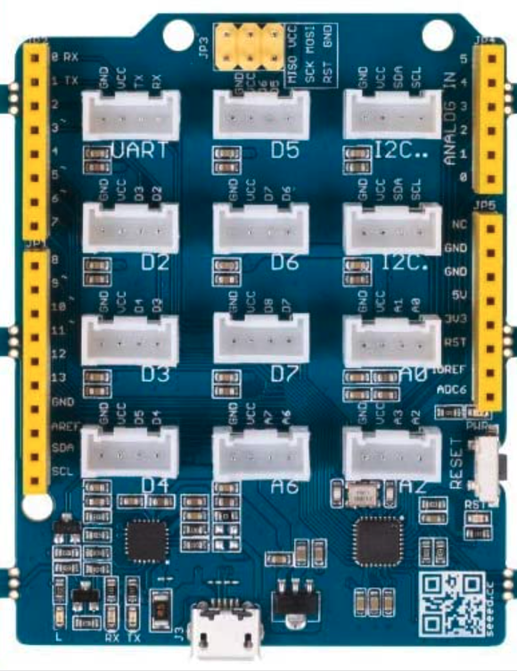
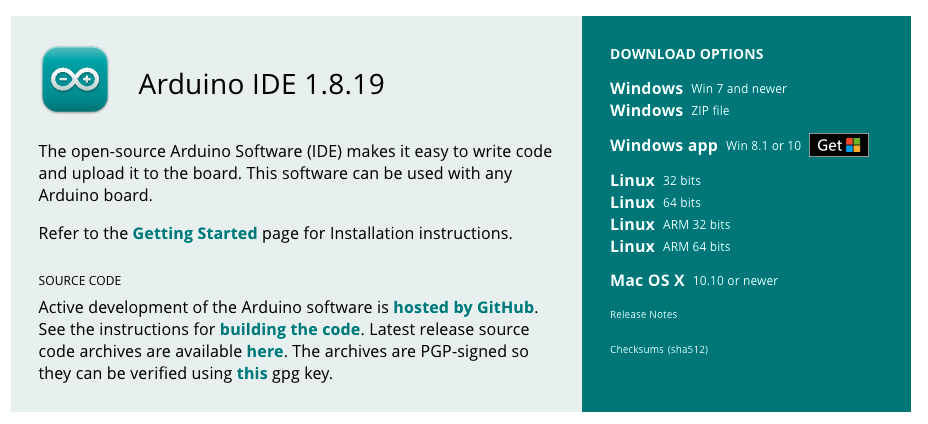
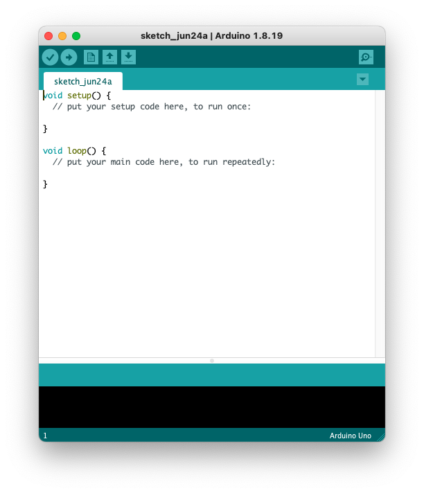

# SES Hardware 101

## Environment Requirements

You will need the Grove Beginner Kit, as well as two additional devices (the mini PIR sensor and the LED light stick) for this workshop.

To write programs for the Arduino and upload them to the device, you will need the [Arduino IDE](https://www.arduino.cc/en/software) software and the [USB Driver](https://www.silabs.com/developers/usb-to-uart-bridge-vcp-drivers) installed onto your computer. Further instructions for this setup are [below](#software-setup).

## Table of Contents

| Title | Components |
| --- | --- |
| [Lesson 1: Turn on the Light](/Lesson01_LED.md) | LED |
| [Lesson 2: Press a Button](/Lesson02_Button.md) | LED, Button |
| [Lesson 3: Doorbell Buzzer](/Lesson03_Buzzer.md) | Button, Buzzer |
| [Lesson 4: Display Text](/Lesson04_OLED.md) | OLED Display |
| [Lesson 5: Digital Dice](/Lesson05_OLED_Pt2.md) | OLED Display, Button |
| [Lesson 6: Graph Data](/Lesson06_Rotary.md) | Rotary Potentiometer, Serial Monitor, Serial Plotter |
| [Lesson 7: Sound Meter](/Lesson07_RGB_LED.md) | RGB LED Strip, Sound Detector |
| [Programming Challenges](/Challenges.md) | All |

## Hardware Basics

Every computing device is made up of four basic components: input, output, storage, and a controller. An input device is how we send commands or data into the computer, an output device is how the computer communicates data back to the user, storage is used to store data and instructions, and the controller is where data is processed within the machine.

Some devices use what is called a **microcontroller**. A microcontroller is a chip that contains both a controller and storage, and is pre-programmed to do a designated task. If you consider a microwave, it has a simple microcontroller that is responsible for responding to button input, setting a timer, turning on the microwave, and then beeping and turning off the microwave when the timer runs out. All of these functions are programmed onto the microwave's microcontroller.

If you consider your laptop, the keyboard, mouse, and webcam are input devices, and the screen and any LEDs are output devices. Some components may act as both an input and output device; consider the touchscreen on a smartphone: this operates as both an input and output device for the computer.The RAM and hard drive on your computer make up the storage, and the CPU is the controller that processes commands. Your laptop is not a microcontroller in and of itself, but it does contain many microcontrollers that help perform individual tasks within it.

Today, we will be working with an Arduino. An Arduino is a single-board microcontroller that can be used to build small, digital computational devices.

The Arduino device included in your Beginner Kit is called a [Seeeduino Lotus](https://wiki.seeedstudio.com/Seeeduino_Lotus/), but we will refer to it as an Arduino throughout these lesson materials.

Your Arduino device is a motherboard that contains a microcontroller (MCU), several input and output ports, and pins. Peripheral devices and sensors (input and output devices) are connected to the Arduino using pins and wires. With traditional Arduino boards, you must connect each sensor and device to the Arduino by hand, using wires. However, your Grove beginner kit is essentially a giant motherboard that directly connects your sensors to the Arduino for us. Additional sensors can be connected to your device using wires, or by using the built-in Grove connectors.

See if you can locate these important parts of the Arduino computer:

- Analog Pins (A0-A5)
- Digital Pins (D0-D13)
- Power Pins
- IC2 Pins (SCL, SDA)
  - uses two lines to send and receive data (serial clock pin and serial data pin)
- UART port
  - Universal Asynchronous Receiver/Transmitter, a circuit used for serial communication between two devices
- ATmega328P-MU
  - Micro-controller chip
- IR Power chip
- USB port

### Sensors

Connected to our Arduino are multiple input and output sensors. Each sensor is pre-connected to a specific pin, which is labeled on the kit.

| Sensor | Pin Type | Pin # |
| --- | --- | --- |
| LED | Digital | 4 |
| Buzzer | Digital | 5 |
| OLED Display | I2C | I2C |
| Button | Digital | 6 |
| Rotary Potentiometer | Analog | A0 |
| Light Sensor | Analog | A6 |
| Sound Sensor | Analog | A2 |
| Temperature & Humidity Sensor | Digital | 3 |
| Air Pressure Sensor | I2C | I2C |
| Accelerometer | I2C | I2C |

You should also have two additional external sensors which we can connect to the device manually:

- Mini PIR Sensor
- LED Strip

## Software Setup

We will use the Arduino IDE to write programs for our Arduino. This software will allow us to write code on our laptops, then send the program to the Arduino to run on the device.

Install the Arduino software for your OS here: <https://www.arduino.cc/en/software>

When prompted, you can click "Just Download".

You will also need to install a USB driver so that your computer recognizes the Arduino device when its plugged in. You can download the [CP2102 USB Driver](https://www.silabs.com/developers/usb-to-uart-bridge-vcp-drivers) here. Click "Downloads" when you get to the webpage and select the software for your operating system.

## Arduino IDE

When you open the Arduino IDE, you will see an empty Arduino program. Each Arduino program is comprised of two primary functions: `setup()` and `loop()`.

The `setup()` function used to initialize the program. We can initialize pins as inputs and outputs, create variables, and set up events. This function will run one time when the program initially runs on the device.

The `loop()` function is an infinite loop that will continually execute commands. This looping mechanism allows us to continually check for input, process, data, and control the output of the computer.

The program will start when the Arduino receives power, and will restart when you press the `Reset` button on the device.

Before we can upload a program to the Arduino, you will need to confirm that your Arduino is connected and that the correct device is configured in your IDE.

- Go to `Tools` > `Board` in the menu and confirm that `Arduino Uno` is selected.
- Go to `Tools` > `Port` and select:
  - `COM1` or `COM11` for Windows (it should say `Arduino Uno` next to the correct option)
  - `/dev/cu.SLAB_USBtoUART` for Mac

Now we're ready to write our first program!

Next: [Lesson 1: Turn on the Light](/Lesson01_LED.md)
