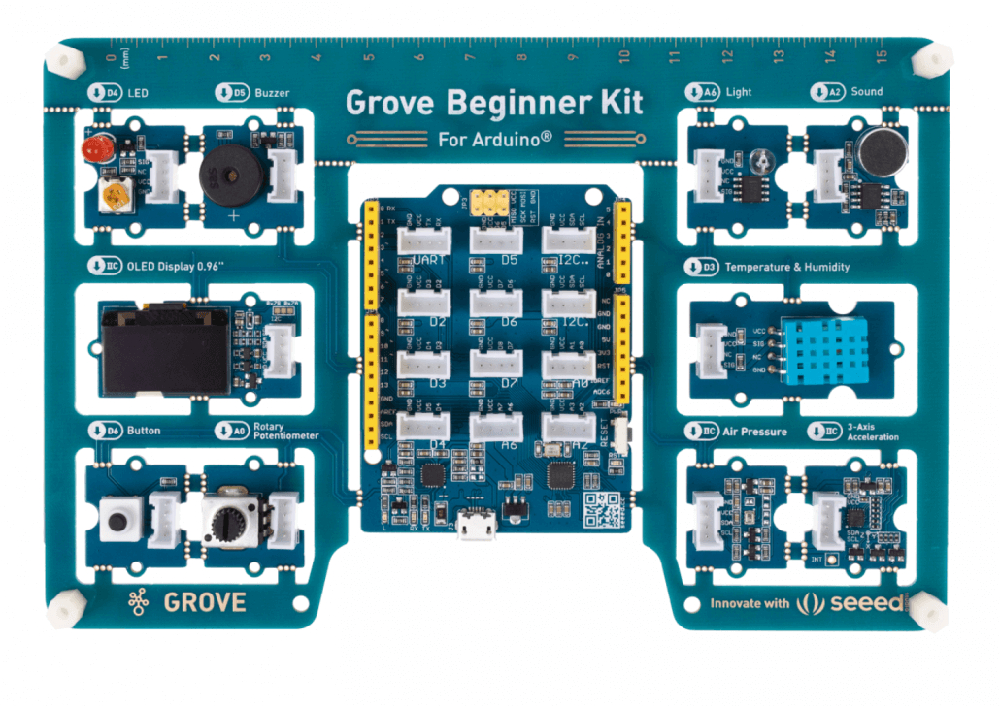

# SES Hardware 101

## Environment Requirements

You will need the Grove Beginner Kit, as well as two additional devices (the mini PIR sensor and the LED light stick) for this workshop.

We will use the Arduino IDE to write programs to send to our Arduino. We'll write the code on our laptops, then send the program to the Arduino to run on that device.

Install the Arduino software for your OS here: <https://www.arduino.cc/en/software>


When prompted, you can click "Just Download".


## Hardware Basics

Every computer is made up of three basic components: input, output, and a controller. An input device is how we send commands or data into the computer, an output device is how the computer communicates data back to the user, and the controller is where data is processed and stored within the machine.

If you consider your laptop, the keyboard, mouse, and webcam are input devices, the screen and any LEDs are output devices, and the CPU, RAM, and hard drive make up the controller that processes commands. Some components may act as both an input and output device. Consider the touchscreen on a smartphone: this operates as both an input and output device for the computer.

Today, we will be working with an Arduino. An Arduino is a single-board micro-controller that can be used to build small, digital computational devices.

The Arduino device included in your Beginner Kit is called a Seeeduino. This device is made up of a motherboard, a micro-controller (MCU), several input and output ports, and pins. Input and output devices and sensors are connected to the Seeeduino via pins and wires. Your beginner kit is essentially a giant motherboard that directly connects several sensors to the Seeeduino for us; however, additional sensors can be connected to the device using wires and pins.


Let's look at some of the important pieces of the Seeeduino computer:

- Analog Pins (A0-A5)
- Digital Pins (D0-D13)
- Power Pins
- IC2 Pins (SCL, SDA)
  - uses two lines to send and receive data (serial clock pin and serial data pin)
- UART
  - Universal Asynchronous Receiver/Transmitter, a circuit used for serial communication between two devices
- ATmega328P-MU
  - Micro-controller chip
- IR Power chip
- USB

### Sensors

Connected to our Seeeduino are multiple input and output sensors. Each sensor is pre-connected to a specific pin, which is labeled on the kit.



| Sensor | Default Pin |
| --- | --- |
| LED | Digital D4 |
| Buzzer | Digital D5 |
| OLED Display | I2C |
| Button | Digital D6 |
| Rotary Potentiometer | Analog A0 |
| Light Sensor | Analog A6 |
| Sound Sensor | Analog A2 |
| Temperature & Humidity Sensor | Digital D3 |
| Air Pressure Sensor | I2C |
| Accelerometer | I2C |

You should also have two additional external sensors which we can connect to the device manually:

- Mini PIR Sensor
- LED Strip

## Arduino IDE

When you open the Arduino IDE, you will see an empty Arduino program. Each Arduino program is comprised of two primary functions: `setup()` and `loop()`.


The `setup()` function used to initialize the program. We can initialize pins as inputs and outputs, create variables, and set up events. This function will run one time when the program initially runs on the device.

The `loop()` function is an infinite loop that will continually execute commands. This looping mechanism allows us to continually check for input, process, data, and control the output of the computer.

The program will start when the Arduino receives power or when you press the Reset button. Let's write our first program!

## Activity #1 - Turn on the Light

The LED is a digital output, which means it operates on a digital signal. This will be a discrete value: 0 or 1. For our Arduino, this means `LOW(0V)` for 0, `HIGH(5V)` for 1.

For the Seeeduino to interact with the LED, we will need to do two things: register the LED as an output device, then send it a digital signal.

We will register the LED as an output device in our `setup()` function. First, we’ll define a global variable for the LED pin.

```c
int LED_PIN = D4;

void setup() {
    pinMode(LED_PIN, OUTPUT);
}
```

Next, in the `loop()` function, we will send a digital signal to the light to turn it on and off.

```c
void loop() {
    digitalWrite(LED_PIN, HIGH);
    delay(1000);
    digitalWrite(LED_PIN, LOW);
    delay(1000);
}
```

The `digitalWrite()` method takes two parameters: the location where we want to send the signal, and the signal we want to send. Here, we’re sending `HIGH` (5V) and `LOW` (0V) signals to our `LED_PIN` with a 1000 millisecond delay in between each signal.

Once our program is written, we need to verify the code and send it to our Arduino.


